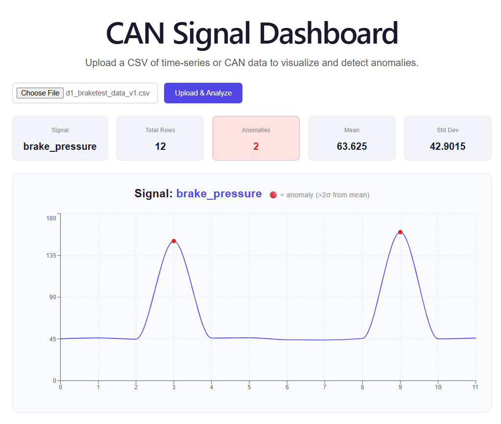

# CAN Signal Dashboard

A full-stack web application for visualizing and detecting anomalies in vehicle CAN bus time-series data.



## What it does
- Upload any CSV of vehicle signal data
- Python backend cleans and analyzes the data using z-score anomaly detection
- React frontend renders an interactive time-series chart with anomalies flagged in red
- Stats cards show signal name, row count, mean, std dev, and anomaly count

## Tech Stack
- **Frontend:** React (Vite), Recharts, Axios
- **Backend:** FastAPI, Pandas, NumPy, Uvicorn
- **Method:** Z-score based anomaly detection (flags points >2σ from mean)

## Running Locally

### Backend
```bash
cd backend
python -m venv venv
venv\Scripts\activate        # Windows
pip install fastapi uvicorn pandas numpy python-multipart
uvicorn main:app --reload
```

### Frontend
```bash
cd frontend
npm install
npm run dev
```

Open `http://localhost:5173`

## Sample Data
Test datasets are included in the `data/` folder:

- **`d1_braketest_data_v1.csv`** — Simple 12-row brake pressure signal with 2 injected spikes. Good for quick testing.