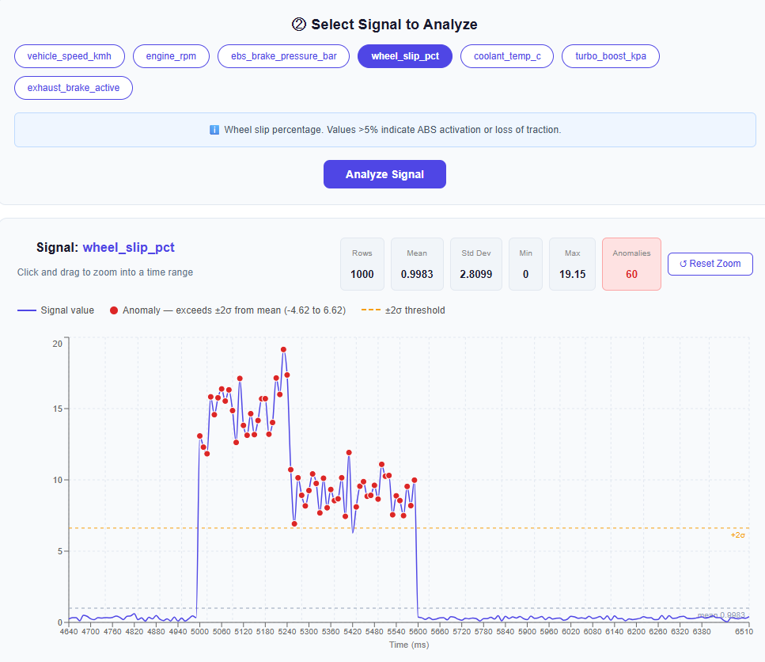

# CAN Signal Dashboard

A full-stack web application for visualizing and detecting anomalies in vehicle CAN bus time-series data.




## What it does
- Upload any vehicle CAN log CSV
- Auto-detects all numeric signals and displays them as selectable buttons
- Each signal has a domain description explaining what anomalies mean
- Python backend cleans data and runs z-score anomaly detection
- Interactive time-series chart with:
  - ±2σ threshold bands shown visually
  - Red dots marking anomalies
  - Smart tooltip showing exact value, σ distance, and anomaly reason
  - Click and drag to zoom into any time range
  - Reset zoom button

## Tech Stack
- **Frontend:** React (Vite), Recharts, Axios
- **Backend:** FastAPI, Pandas, NumPy, Uvicorn
- **Method:** Z-score based anomaly detection (flags points >2σ from mean)

## Running Locally

### Backend
```bash
cd backend
python -m venv venv
venv\Scripts\activate        # Windows
pip install fastapi uvicorn pandas numpy python-multipart
uvicorn main:app --reload
```

### Frontend
```bash
cd frontend
npm install
npm run dev
```

Open `http://localhost:5173`

## Sample Data
Two test datasets included in `/data`:
- `d1_braketest_data_v1.csv` — simple 12-row brake pressure signal, good for quick testing

- `d2_class8_truck_can_log.csv` — realistic Class 8 truck CAN log, 1000 samples at 10ms intervals across a full highway drive cycle with 7 signals and 4 injected fault events. 
The truck accelerates from a truck stop to governed highway speed (105 km/h), cruises on I-40, then a cut-off forces a hard panic stop — ABS activates, brake engages, EBS hits 11.5 bar. After the incident, the truck resumes speed while climbing a long grade, pushing coolant temp into overtemp territory.
